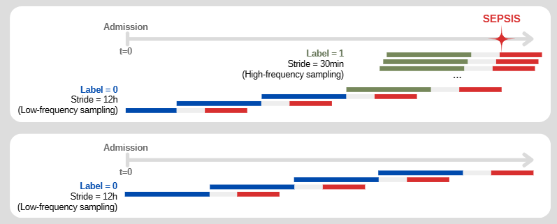
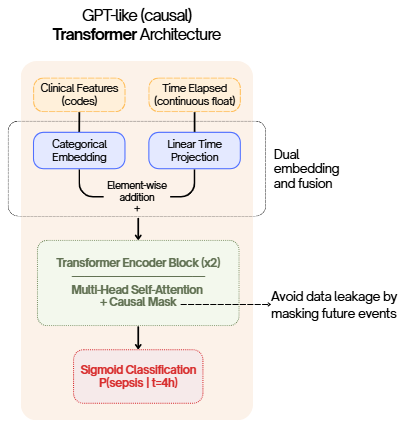
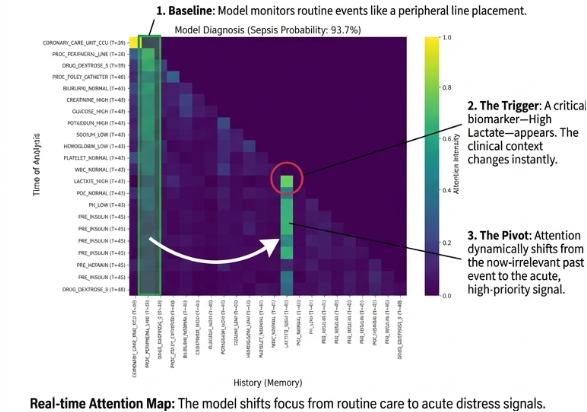

# Dynamic Event Trajectory Modeling for Early Sepsis Prediction

**Authors:** Billel Aissani, Lou-Ann Le Grand, François Chapuis
**Context:** Deep Learning for Electronic Health Records (EHR) Project

## Project Overview
Sepsis is a leading cause of mortality in ICUs (approx. 20% of global deaths). Early prediction is critical as mortality increases by 7.6% for every hour of delayed treatment.

The goal of this project is to predict sepsis onset by modeling the full trajectory of patient events, rather than relying on static snapshots at admission.

## Dataset & Access
We used the **MIMIC-IV v3.1** dataset (approx. 29,000 selected patient trajectories).

**Important:** This dataset is restricted. Due to the PhysioNet Data Use Agreement (DUA), **no data files are included in this repository**. To reproduce the experiments:
1. Obtain credentialed access via [PhysioNet](https://physionet.org/).
2. Download MIMIC-IV.
3. Run the preprocessing scripts.

## Methodology
We treated patient history as a temporal sequence. We used a sliding window approach with a 12h observation window and a 6h prediction window.

*Figure 1: Data sampling strategy with observation and prediction windows.*

We compared three architectures:
1.  **Baseline:** XGBoost with Bag of Words approach.
2.  **Sequential:** LSTM (Long Short-Term Memory).
3.  **Proposed Model:** Time-Aware Transformer (GPT-like causal architecture).

*Figure 2: Overview of the Time-Aware Transformer architecture.*

## Results
We evaluated the models on AUROC and AUPRC metrics.

| Model | AUROC | AUPRC | Recall (Sepsis) |
|-------|-------|-------|-----------------|
| XGBoost | 0.794 | 0.437 | - |
| LSTM | 0.840 | 0.537 | 70% |
| **Transformer** | **0.840** | **0.520** | **73%** |

## Interpretability
While performance is similar to LSTM, the Transformer offers explainability through Attention Maps. The model successfully identifies clinical shifts, such as moving focus from routine care events to critical biomarkers (e.g., High Lactate) when they appear.

*Figure 3: Attention weights shifting to 'High Lactate' event.*

## Limitations
* **Performance Ceiling:** Results plateaued at AUPRC ~0.52 using structured data alone.
* **Future Work:** Integrating unstructured clinical notes (NLP) could further improve performance by capturing narrative context.
